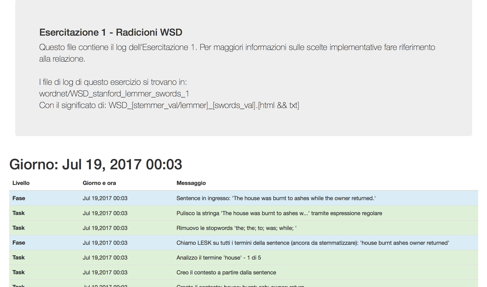

# Cognitive System - Word Sense Disambiguation + Rocchio classifier

A semantics-related task library with LESK and Rocchio implementation that mainly use Wordnet and Babelnet, made as part of my final exam for the Cognitive System course in Department of Computer Science. This README is made in ```nightly-build``` mode, so please excuse me for typos. The entire project is fully commented using italian, as log and cli because I'm from Italy and I was a newbie - [see also](https://github.com/made2591/cognitive-system-postagger). One day - again - I will translate this, promised :D :D :D !!!

### Contents:

[[1] Execution](#execution)

[[2] Main files](#main-files)

[[3] Log files](#logs)

[[4] Notes](#notes)

[[5] Contacts](#contacts)

### <a name="execution"></a>Execution
Run on Java 1.7 and higher. Requirements: 

1) Download [required resources - waiting for upload](#todo), unzip and place them under the ```src``` folder, at the same level of ```uni``` folder;
2) Go to [Babelnet API](http://babelnet.org/guide) and register for a free API (needed to access sense online resource);
3) Configure ```ROOT_PROJECT_DIR``` and ```ROOT_PROJECT_LOG_DIR``` static field of ```MMConfig.java``` class (under ```uni/sc/util```) using absolute path and pointing respectively ```log``` dir (root) and ```res``` dir (yes, the one you unzipped in step 1)). To summarize:

```shell
git clone https://github.com/made2591/cognitive-system-semantics.git
cd cognitive-system-semantics/src
wget http://####
unzip res.zip
rm res.zip
cd ..
```

To run the exercises import project in IntelliJ IDEA or equivalent and run ```Main.java```. Then follow shell instruction (sorry for italian, again): the main program will guide you. Choose the number of exercise and configuration to run. The default program use a logger, which shows the main steps of the execution of the various procedures. To change the configuration of the file locations please refer to the config file mentioned before. To enable file logging, change the verbosity follow cli instructions. File logs are produced in both format, txt and html - pretty print - format using ```MMLogger.java```. HTML appears as shown below:



### <a name="main-files"></a>Main files

The files with core algorithm of 4 main exercise are situated in ```uni.sc.radicioni.*``` packages:

- wordnet
- babelnet
- rocchio
- rdf

##### Wordnet

Available options for Lesk stemmer / lemmer:

1) Stemmer RiTa;
2) External Stemmer;
3) Lemmer StanfordNLP Parser (Default);

You can also use different stopwords files and choose disambiguation term (empty = clear all terms);

##### Babelnet

Choose disambiguation term (empty = clear all terms);

##### Rocchio

Available options for centroid computation (cli):

1) Centroids computation using average of the documents belonging to the same class;
2) Centroids computation using POSITIVE and NEGATIVE;
3) Centroids computation using POSITIVE and NEAR POSITIVE;

Available options for NEAR POSITIVE computation (cli): for each option, the (min-max) cardinality of classes available to be considered NEAR POSITIVE, where ```*``` means ```all``` and ```0``` means that the formula for that class will retain the old centroid:

1) Class (1-1) with which more errors have been made (development / training);
2) Classes (0- *) with which at least one error (development / training) was made;
3) Classes (1- *) with which at least one error (development / training) was made: if the set is empty, all classes;
4) Class (1-1) with centroid closest to the examined class;

CLI asks also for Beta and Gamma values.

The space vector model saving option:

0) If exist, load the last documents from the file (Default);
1) Performs training, builds the vector model without saving;
2) Performs training, builds the vector model by saving to files;

Finally, CLI provides also choices for space vector model randomization option:

0) Randomize the order of documents (re-training using other documents, useful for mediating results) (Default);
1) Uses the natural order of extraction of documents (always equal, for punctual comparisons);

### <a name="logs"></a>Log files

In the log there are sum folders - one for each exercise. Starting from file name and content you can retrieve all information about execution.

__NOTE 1__: ```lib``` contains css, js and fonts needed by html log pages.

### <a name="notes"></a>Notes

__NOTE 1__: Some of the config parameters do not have to be explained because they are required during run time. Non required parameters are listed within the config and mainly concern paths of files involved in the dumping of data structures and logging.

__NOTE 2__: [Referring to Babelnet] To calculate NEAR POS you can make use of four different algorithms: one of the available version requires to run the algorithm in a version that considers all NEGs, with a testing phase to see where is more confusing and a recursive phase of the centroid on the basis of the most frequent errors. To complete the mid-test phase, you can decide to give up a portion of the elements during training / testing and keep them for the intermediate phase of 'developing' (or tuning) of the centroid. If this percentage (called developing) is set to 0.0, for the intermediate test phase will be used the same training documents used during the training phase.
During the execution that doesn't need to calculate NEAR POSITIVE, the document set is divided in only two parts and the percentage of developing set is not required (no developing set is being used, as training takes place all at once).

__NOTE 3__: [Referring to Babelnet] Babelnet use a cache to prevent limitation due to free API. See ```MMBabelNet.java``` for more details about.

### <a name="contacts"></a>Contacts

If something goes wrong, please write to matteo.madeddu@gmail.com